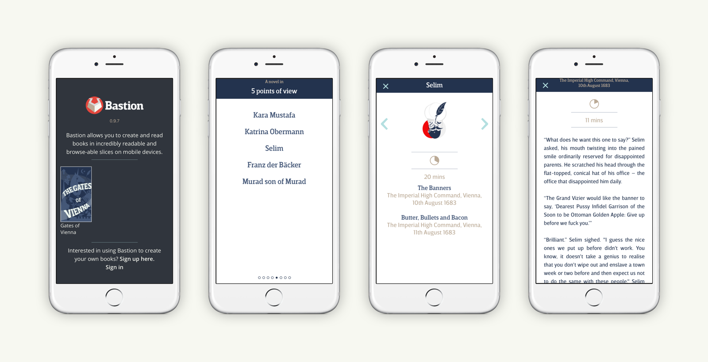
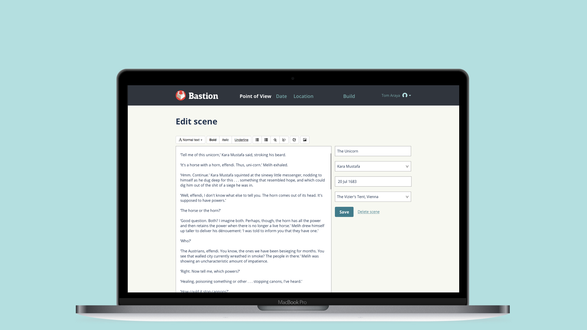
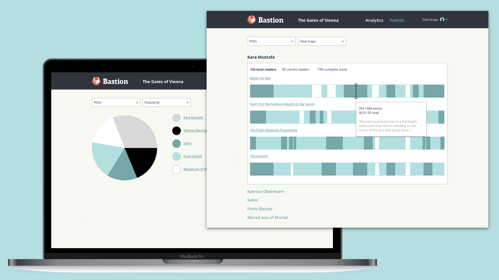

# Bastion

Bastion is a platform where the reader can choose how they want to read, choosing either a point of view...

...or time, or location on a map.

There is a content management system where authors and editors can work together to publish on the Bastion platform, creating successive versions of their books which they can keep on expanding and growing in points of view, times and locations. This publishes to the mobile app available on the iOS App Store.

We've also been working on analytics for the platform, designing a way to see what works for readers and how, looking at how well read each scene, point of view, etc. are.

Bastion is a publishing platform you can read and provide books in incredibly readable slices on mobile devices.

Most  apps and e-readers are focused on one thing, trying to shove thousands  of years of printed reading into a device as is. I don't think it should  be this way.

The novel is purported to be over 400 years old, but  the way we read today is not. Yet, books and narrative worlds are still  presented the same way.

Bastion is a way where you can explore a  story world, choosing how you read through lots of things happening all  at the same time. You can read all the way through one point of view of  whats going on, or maybe you just want to find out what happened in a  particular place. Its up to you how to explore and read.
