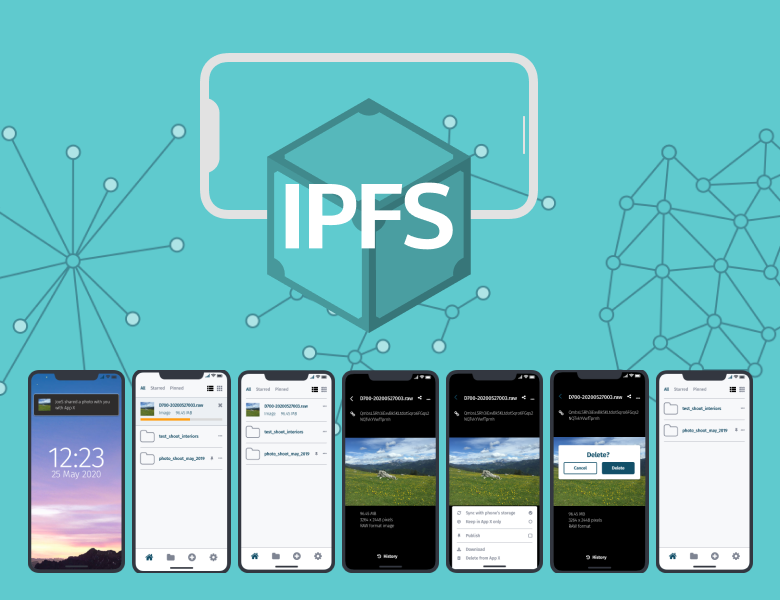

# Hi, I'm Jim

## I design products, services and strategies

I research and design interactions and interfaces that are meaningful, systems that are liveable and make emerging technologies practical realities for the following organisations and more:

    

To find out more about the specifics, you might want to look at the [FAQ](faq.html). Below are a 
few examples of what all of this looks like, and there is more in the [archive](archive.html).

&nbsp;

    

        
        
A bunch of stuff for the first column

    

    

        
        
A bunch of stuff for the second column

    

&nbsp;

[More projects here...](archive.html)

&nbsp;