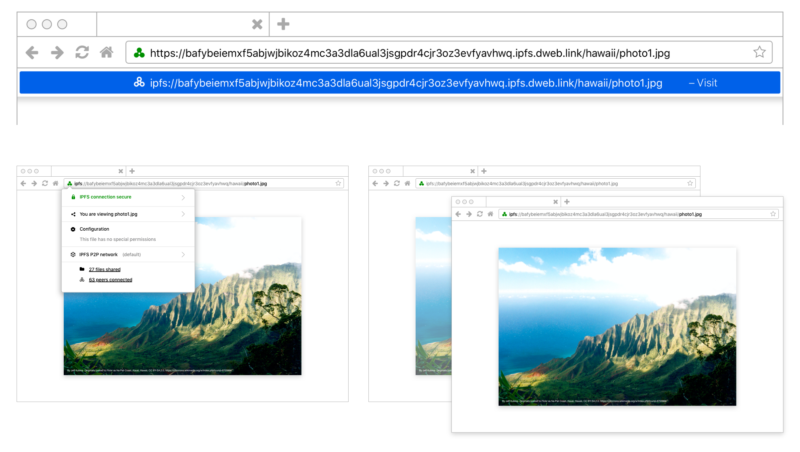

# IPFS Browser Design Guidelines

The [InterPlanetary File System](https://ipfs.io/){:target="_blank"} (IPFS)  is a way to have an safer, faster, freer Internet. This new internet lives without central servers or centralised control through a protocol and peer-to-peer (P2P) network for storing and sharing data.

In preparation for a 2020 expansion of Protocol Lab’s IPFS browser integrations and standardisation efforts, they needed guidelines and recommendations on hand in order to get to their first billion users. This is what we started doing by designing how IPFS would be used in a browser.

The guidelines, due to be open sourced and published, are due to be presented to the standards bodies the IETF and the WC3. The guidelines provide research-based, user-centred direction as to how to replace HTTP and HTTPS with the IPFS protocol.

View on [Github](https://github.com/ipfs/browser-design-guidelines) (MIT license).
