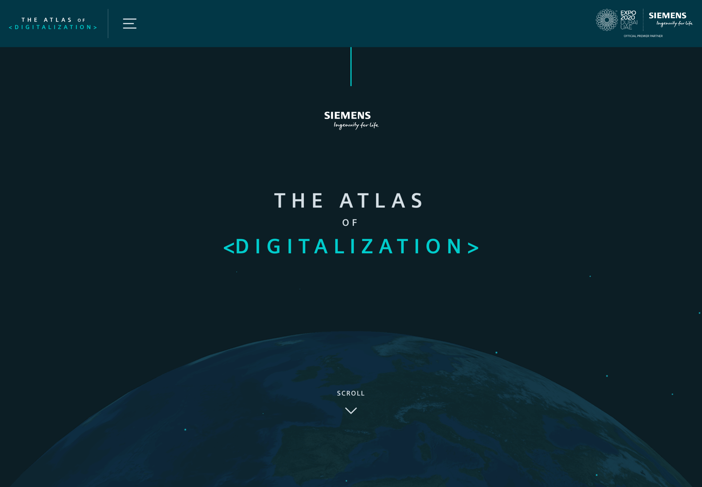
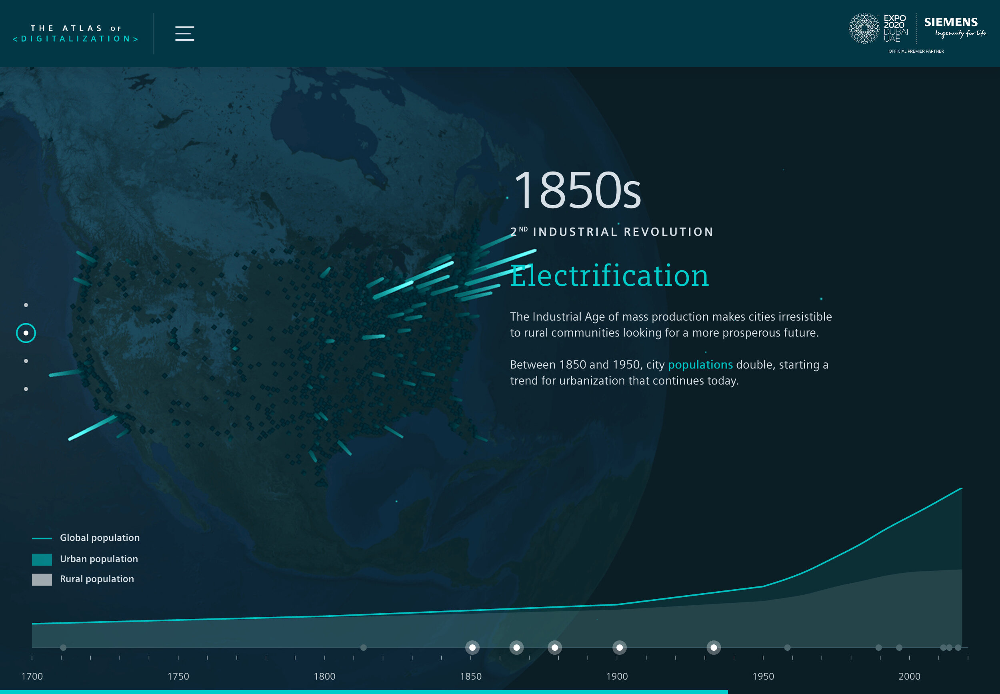
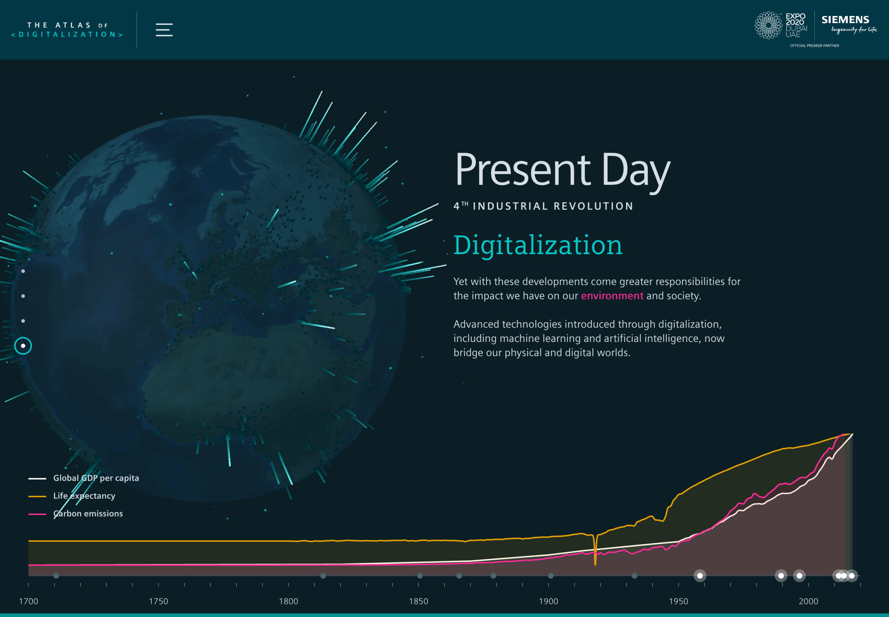
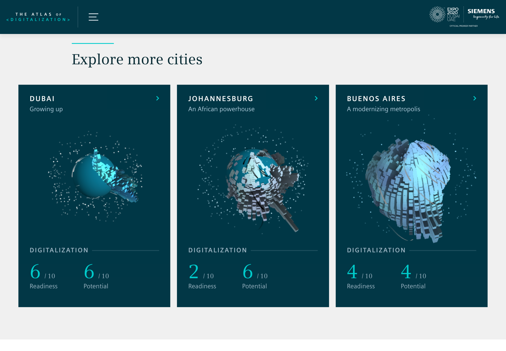
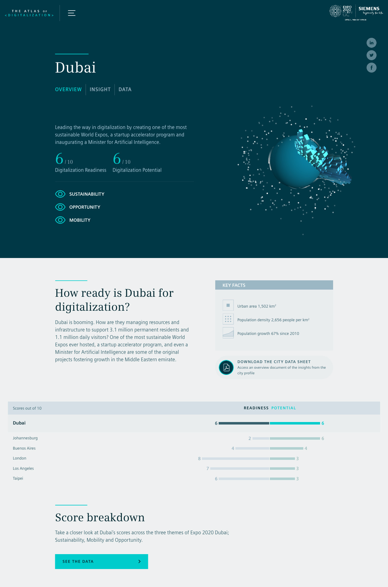

# Siemens

For Signal-Noise (part of the The Economist Group) I worked on the user experience, data and storytelling of the Atlas of Digitalization, a visualisation for Siemens exploring the effects and impacts of technology on our urban lives and how to make smart cities better.

[atlas.dc.siemens.com](atlas.dc.siemens.com)

